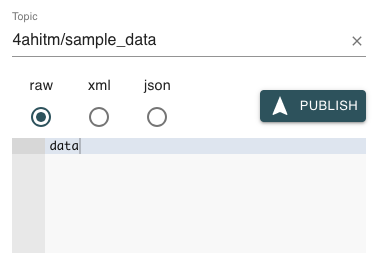

# Mosquitto with Quarkus

## Startup

### Start MQTT

```bash
docker-compose -f docker-compose.mqtt.yml up
```

### Start Quarkus

```bash
mvnw clean compile quarkus:dev
```

### Publish Data
Open MQTT Explorer and publish data under the topic `4ahitm/sample_data`.
As soon as the data is published quarkus will log the value of the data into the console.



